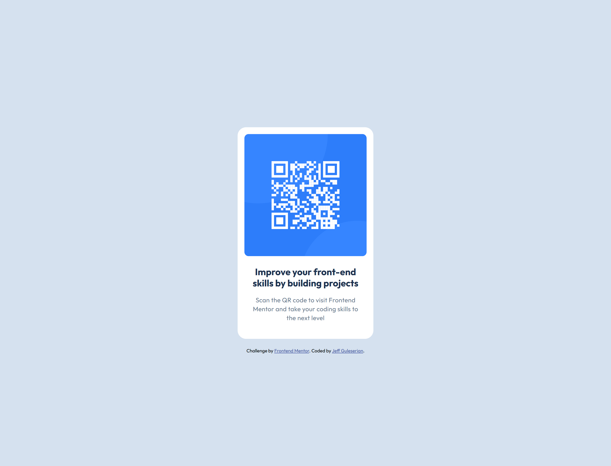

# Frontend Mentor - QR code component solution

This is a solution to the [QR code component challenge on Frontend Mentor](https://www.frontendmentor.io/challenges/qr-code-component-iux_sIO_H).

## Table of contents

- [Overview](#overview)
  - [Screenshot](#screenshot)
  - [Links](#links)
- [My process](#my-process)
  - [Built with](#built-with)
  - [What I learned](#what-i-learned)
  - [Continued development](#continued-development)
  - [Useful resources](#useful-resources)
- [Author](#author)

## Overview

The challenge is to build out this QR code component and get it looking as close to the design as possible.

I also added a couple of extras including:
- A drop-shadow hover effect for the QR code
- Turn the QR code into a live, clickable link

### Screenshot

### Links

- Solution URL: [See my solution on GitHub](https://github.com/jguleserian/FMC-QR-Code-Component-2.git)
- Live Site URL: [Add live site URL here](https://jguleserian.github.io/FMC-QR-Code-Component-2/)

## My process

### Workflow:

1. Set up folders and file structure, set up README.md, create GitHub repo and link it to VS Code 
2. Determine strategy for structuring the page
3. HTML: set major structure with containers, placing the general content within them
4. HTML: starting from the top with each major container, assign content to individual elements and arrange them as necessary.
5. HTML: link and place <picture> and  / <source> files as necessary. Set media query sizes as necessary.
6. CSS: set up.
  - "Pencil in" the major structure using GPS: "reset & variables," "containers," "elements," "classes & ids," "media queries"
  - Write the CSS for the page reset in the ":root," <html>, <body>, and *. I generally put in the variable for colors, font, etc. at this time.
  - Set the media queries, adding in a change of background color so I can visually identify what query I am viewing and to have an element in the query as a placeholder
7. Starting from top to bottom in the HTML, set the CSS styles. 
8. Style/add hover states and animation as necessary
9. Clean up code
10. Test functionality, responsiveness, and similitud with original model in Figma/style guide
11. Upload and publish

### Built with

- Semantic HTML5 markup
- CSS variables
- Flexbox
- Mobile-first workflow

are just examples. Delete this note and replace the list above with your own choices**

### What I learned

The purpose of redoing this project was to follow the learning path suggestions. Just to make sure there are no gaps in my understanding, I have decided to walk throught the learning paths one at a time form the beginning.

### Continued development

Specifically, to walk through all the learning paths of Frontend Mentor.

### Useful resources

- [GPS for CSS Organization](https://github.com/jescalan/gps) - This is the guide I have been using to organize my CSS. It is much more succinct than other methods, accommodates large projects and collaboration and is logically formed, and so logical to read.

## Author

- GitHub - [@jguleserian](https://github.com/jguleserian)
- Frontend Mentor - [@yourusername](https://www.frontendmentor.io/profile/jguleserian)
- LinkedIn - [@yourusername](https://www.linkedin.com/jeffguleserian)

